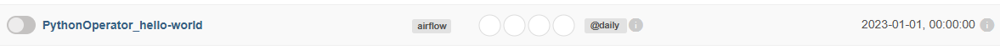

Commençons par un classique de l'informatique : Hello world !

L'idée ici est de créer un DAG qui automatisera le lancement de notre fonction helloworld.

### Etape 1 : Ecrire la fonction helloworld
```python
def helloworld():
    print("Hello, World!")
```

### Etape 2 : Instancier le DAG
Un DAG doit **obligatoirement** avoir les arguments suivants :

- *dag_id* : est une chaine de caractère sans espaces.
- *schedule_interval* : est une chaine de caractère, un objet timedelta ou None. ([Voir ici](https://airflow.apache.org/docs/apache-airflow/1.10.1/scheduler.html#dag-runs))
- *start_date* : est un objet datetime qui contient la date de première exécution.

```python
with DAG(
    dag_id='hello-world',
    schedule_interval='@daily',
    start_date= datetime(2023, 1, 1),
) as dag:
```

Le DAG ci-dessus s'appelle "hello-world". Il est prévu qu'il s'exécute chaque jour (`schedule_interval='@daily'`) à partir du 1er janvier 2023.

### Etape 3 : Associer la fonction au DAG
Pour associer la fonction *helloworld* au DAG, il faut écrire une tache.

```python
hello_task = PythonOperator(
	task_id='hello_task',
	python_callable=helloworld
)
```
On instancie un objet PythonOperator qui utilise l'identifiant *hello_task* (`task_id='hello_task'`) et appelle la fonction *helloworld* (`python_callable=helloworld`).

### Etape 4 : On rassemble chaque étape !

Pour fonctionner, il faut également inclure les importations requises. Au final, notre dag va ressembler à ceci :

```python
from airflow import DAG
from airflow.operators.python import PythonOperator
from datetime import datetime

def helloworld():
    print("Hello World")

with DAG(
    dag_id='PythonOperator_hello-world',
    schedule_interval='@daily',
    start_date= datetime(2023, 1, 1),
) as dag:
    
    hello_task = PythonOperator(
        task_id='hello_task',
        python_callable=helloworld
    )
```

Une fois le DAG chargé dans Airflow, vous pouvez le retrouver dans la liste :


Il ne reste plus qu'à l'activer en cliquant sur le bouton à gauche.