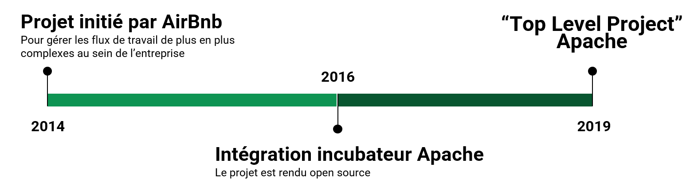

# 1 - Qu’est ce que Airflow ?

<!-- <ul style="list-style-type: none; padding-left: 150px;font-size: 1.5em;">
    <li style="position: relative;">
        → Item 1
    </li>
    <li style="position: relative;">
        → Item 2
    </li>
    <li style="position: relative;">
        → Item 3
    </li>
</ul> -->

<ul style="list-style-type: none; padding-left: 0;  font-size: 1.5em;">
    <li style="display: flex; align-items: center;">
        → Plateforme de gestion de flux de travail open source.
    </li>
    <li style="display: flex; align-items: center;">
        → Écrit en Python
    </li>
</ul>

